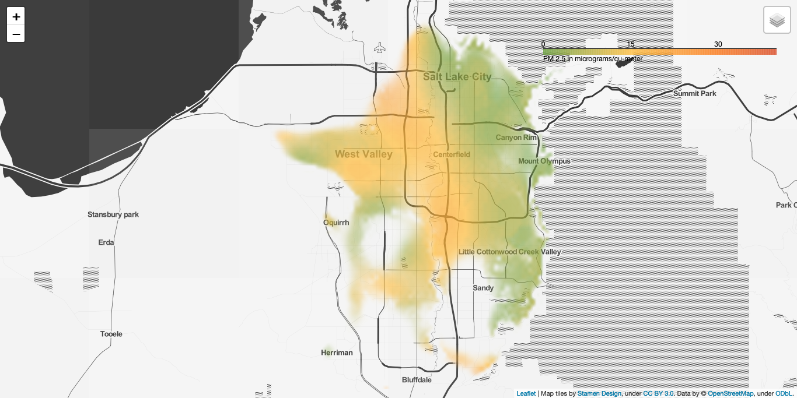

# Tetrad Visualization Toolkit

Once filled out, this repository will hold a number of tools for downloading and visualizing air quality data stored in our database. At the moment we have two tools:
- Generate static map visualizations
- Generate animations over time

Generated maps look like this:



### Getting Started
The fastest way to get up and running is by installing [pipenv](https://pipenv.pypa.io/en/latest/)

```bash
pipenv install --skip-lock -r requirements.txt
```

### Examples
Check the `examples` folder for Jupyter Notebooks containing examples. 

```bash
pipenv run jupyter-notebook examples
```